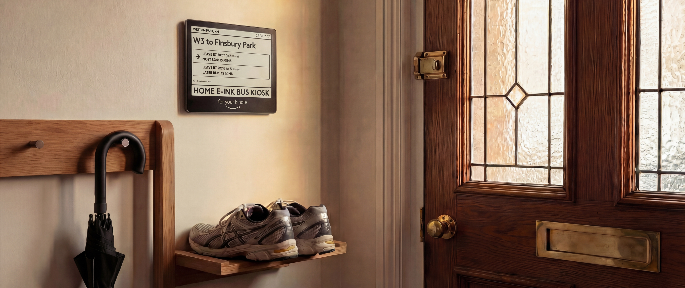
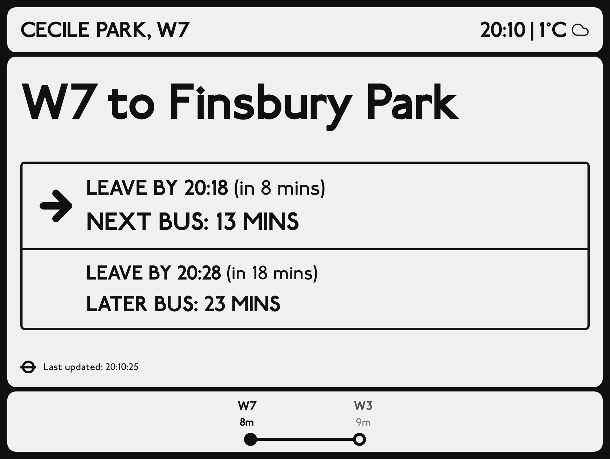

# TFL London Bus Kiosk for KOReader

Turn your Kindle into a real-time TfL bus departure board.



*Use physical buttons or swipe to switch between your favourite stops*

## Features

- **Real-time arrivals** from TfL API
- **Smart "leave by" times** that account for your walk to the stop
- **Multiple stops** with button/swipe navigation
- **Weather display** with current temperature
- **E-ink optimized** with high contrast grayscale design
- **Auto-refresh** every 30 seconds

## Requirements

- Kindle with [KOReader](https://github.com/koreader/koreader) installed
- Computer to run the renderer (macOS or Linux)
- Node.js 18+
- Python 3.9+
- `sshpass` for syncing to Kindle

## Quick Start

### 1. Clone and configure

```bash
git clone https://github.com/yourusername/koreader-tfl-dashboard.git
cd koreader-tfl-dashboard

# Copy config template
cp sync/config.example sync/config
```

### 2. Edit your configuration

Open `sync/config` and set your bus stops:

```bash
# Number of stops to display
STOP_COUNT=2

# Stop 1
STOP_1_ID=490014509S          # TfL stop ID (see below)
STOP_1_BUS_LINE=W3            # Bus line to track
STOP_1_ROUTE_NAME="W3 to Finsbury Park"
STOP_1_STOP_NAME="Weston Park"
STOP_1_WALK_TIME_MINUTES=6    # Your walk time to this stop

# Stop 2
STOP_2_ID=490009999Z
STOP_2_BUS_LINE=9
STOP_2_ROUTE_NAME="9 to Kensington Palace"
STOP_2_STOP_NAME="Hyde Park Corner"
STOP_2_WALK_TIME_MINUTES=10
```

### 3. Find your TfL stop ID

1. Go to [TfL Stop Point Search](https://api.tfl.gov.uk/StopPoint/Search)
2. Search for your stop name
3. Copy the `naptanId` (e.g., `490014509S`)

Or use the API directly:
```bash
curl "https://api.tfl.gov.uk/StopPoint/Search?query=Weston+Park"
```

### 4. Install dependencies

```bash
# Web app
cd dashboard-web && npm install && cd ..

# Python renderer
cd renderer
python3 -m venv venv
source venv/bin/activate
pip install -r requirements.txt
cd ..

# sshpass (macOS)
brew install hudochenkov/sshpass/sshpass
```

### 5. Install the KOReader plugin

Copy the plugin to your Kindle:

```bash
# Via USB (Kindle mounted at /Volumes/Kindle)
cp -r koreader-plugin/dashboard.koplugin /Volumes/Kindle/koreader/plugins/

# Or via SSH if already set up
scp -r -P 2222 koreader-plugin/dashboard.koplugin root@<kindle-ip>:/mnt/us/koreader/plugins/
```

### 6. Configure Kindle connection

Add your Kindle's network details to `sync/config`:

```bash
KINDLE_IP=192.168.1.XXX   # Your Kindle's IP
KINDLE_PORT=2222          # KOReader SSH port
KINDLE_USER=root
KINDLE_PASSWORD=          # Leave empty for passwordless
KINDLE_DASHBOARD_PATH=/mnt/us/dashboard
```

To find your Kindle IP, enable SSH in KOReader:
**KOReader menu > Network > SSH server > Enable**

### 7. Run it

```bash
# One-time render + sync
./start.sh --sync

# Continuous mode (production)
./start.sh --kindle
```

## Controls

| Input | Action |
|-------|--------|
| Page buttons | Switch between stops |
| Swipe left/right | Navigate stops |
| Tap | Show KOReader menu |
| Long press | Exit kiosk mode |

## Configuration Reference

### Bus stops

You can configure up to 10 stops. Each stop needs:

| Variable | Description |
|----------|-------------|
| `STOP_X_ID` | TfL NaPTAN stop ID |
| `STOP_X_BUS_LINE` | Bus route number |
| `STOP_X_ROUTE_NAME` | Display name for the route |
| `STOP_X_STOP_NAME` | Display name for the stop |
| `STOP_X_WALK_TIME_MINUTES` | Minutes to walk to this stop |

### Weather

Weather uses [Open-Meteo](https://open-meteo.com/) (free, no API key needed).

```bash
# Get coordinates from Google Maps (right-click > copy coordinates)
WEATHER_LATITUDE=51.5014
WEATHER_LONGITUDE=-0.1419
```

## Usage Modes

```bash
./start.sh              # Render once, open in browser
./start.sh --sync       # Render once, sync to Kindle
./start.sh --kindle     # Continuous render + sync (production)
./start.sh --loop       # Continuous render only (no sync)
```

## How It Works

```
Next.js app        Python renderer       Kindle
┌──────────┐       ┌─────────────┐       ┌─────────────┐
│ /render  │──────>│ Playwright  │──────>│ KOReader    │
│ fetches  │ HTTP  │ screenshot  │  SCP  │ plugin      │
│ TfL API  │       │ + grayscale │       │ displays    │
└──────────┘       └─────────────┘       └─────────────┘
```

1. Next.js fetches live data from TfL and Open-Meteo APIs
2. Playwright screenshots the dashboard at 1264x1680 (Kindle Oasis resolution)
3. Pillow converts to grayscale for e-ink display
4. SCP syncs the image to Kindle over SSH
5. KOReader plugin displays fullscreen and auto-refreshes

## Troubleshooting

**SSH connection fails**
- Ensure SSH is enabled in KOReader (Network > SSH server)
- Check your Kindle IP hasn't changed (use a static IP or check router)
- Verify `sshpass` is installed

**Plugin not appearing**
- Restart KOReader after copying the plugin
- Check plugin is in `/mnt/us/koreader/plugins/dashboard.koplugin/`

**Image not updating**
- The plugin refreshes every 30 seconds
- Check the "Last updated" timestamp on the dashboard
- Try "Refresh Now" from the plugin menu

## License

MIT
